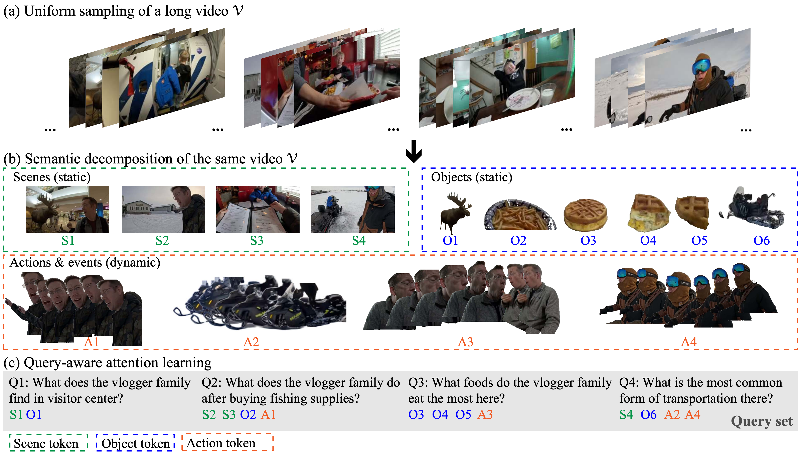

# SEAL: SEmantic Attention Learning for Long Video Representation



**Long Video Representation with Semantic Attention Learning SEAL:** Conventional uniform sampling results in redundant and cluttered visual information, making it difficult for both AI models and human brains to process efficiently. Decomposing long videos into semantic entities such as scenes, objects, and actions reduces temporal redundancy, thus making model training and inference more efficient. In this example, the long video **$\mathcal{V}$** is decomposed into:  **4 scene tokens** (S1--S4),  **6 object tokens** (O1--O6) , **4 action/event tokens** (A1--A4). A query-aware attention learning module improves downstream task performance by focusing on relevant information rather than processing everything, as shown with queries (Q1--Q4) and their most relevant tokens. 


## 🔥 Updates

## Citation

```
@article{rout2024rbmodulation,
  title={SEAL: Semantic Attention Learning for Long Video Representation},
  author={Wang, L and Chen, Y and Chu, W and Boddeti, V and Tran, D},
  journal={arXiv preprint arXiv:xxxx.xxxx},
  year={2024}
}
```
